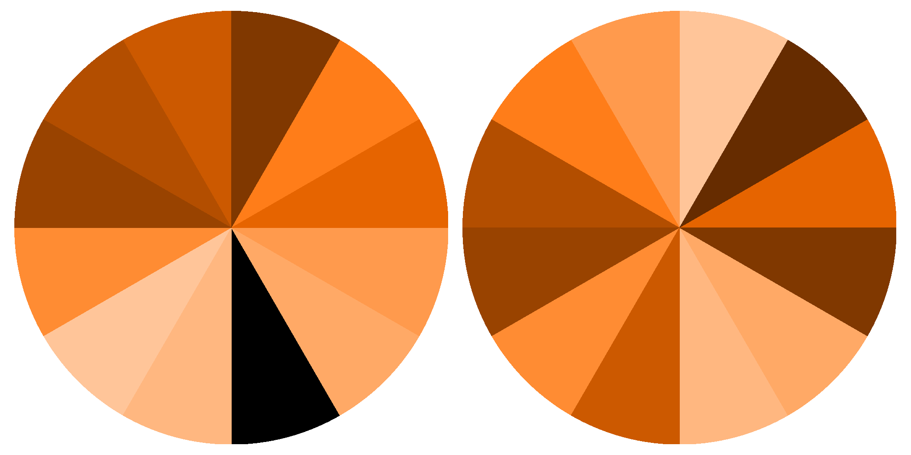

# heatmap_for_discord_channel

## USAGE
Use [DiscordChatExporter](https://github.com/Tyrrrz/DiscordChatExporter) to export your desired channel into a csv file.

```
$ ./generateGraph.py <csvFile.csv>
```

## Result

First circle is for _AM_ and the second one is for _PM_

Black: No messages